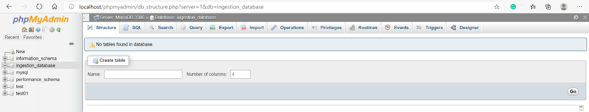
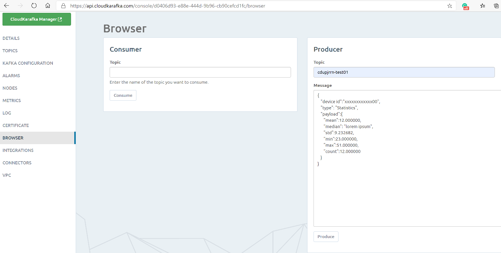
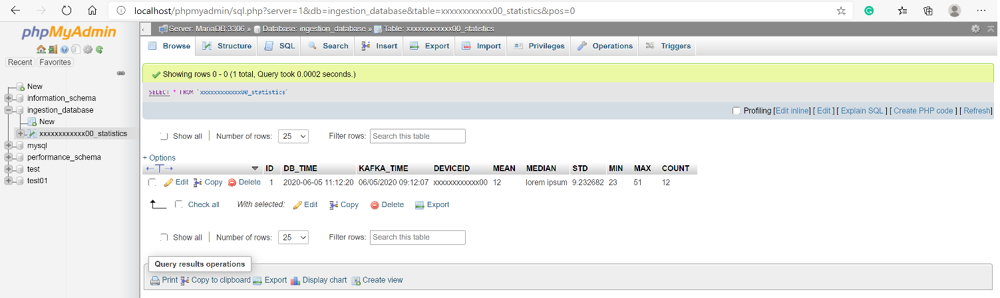
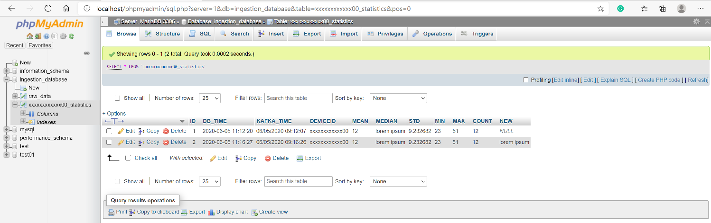
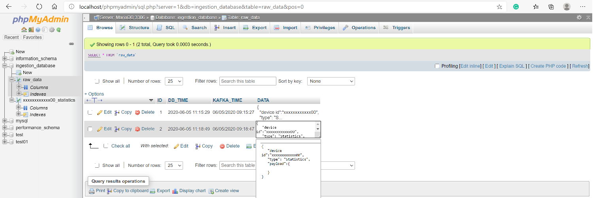
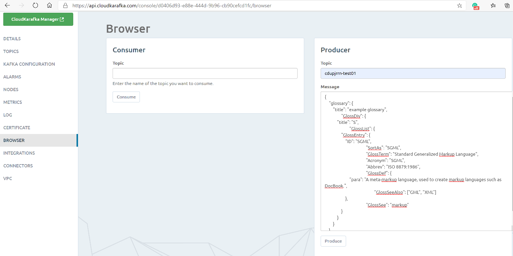
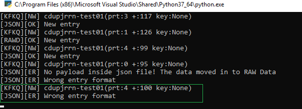

# Dynamic Database Creation Using Kafka Queue Streaming Messages
The aim of this project is to ingest incoming Kafka streaming messages and store those dynamically into a database without the mandatory existence of predefined SQL Tables.

## Table of Contents
-   [General Info](https://github.com/atheo89/DynamicDatabaseConstractorUsingKafka/blob/master/README.md#General Info)
-   [Technologies](https://github.com/atheo89/DynamicDatabaseConstractorUsingKafka/blob/master/README.md#Technologies)
-   [Getting started](https://github.com/atheo89/DynamicDatabaseConstractorUsingKafka/blob/master/README.md#Getting started)
-   [Examples of use](https://github.com/atheo89/DynamicDatabaseConstractorUsingKafka/blob/master/README.md#Examples of use)

## General Info
Data and logs that surround us need to be processed, reprocessed, analyzed and handled. Often in real time. That's what makes the core of the web, IoT, cloud-based and etc living today. And that's why Apache Kafka has come to play a significant role in the message streaming landscape. 


## Technologies

Built with:
 1. Python 3.7
 2. Apache Kafka 2.5
 3. SQL/phpmyadmin 4.9.2
 4. JSON 

## Getting started
### Set up Apache kafka Producer
To be able to getting started the project you need to set up a CloudKarafka instance. CloudKarafka automates every part of the setup - it provides a hosted Kafka solution, meaning that all you need to do is sign up for an account and create an instance. You do not need to set up and install Kafka or care about cluster handling. CloudKarafka can be used for free with the plan Developer Duck. 
When your instance is created, click on details for your instance. Before you start coding you need to ensure that you can set up a secure connection. To get started with your free instance you need to download the Certificates (connection environment variables) you can find those in the download button from the instances overview page. It is named: Certs, Press the button and save the given .env file into your project. The file contains environmental variables that you need to use in the project.

Setup your free Apache Kafka instance here: [https://www.cloudkarafka.com](https://www.cloudkarafka.com/) 
Configuration:

-   `export CLOUDKARAFKA_BROKERS="host1:9094,host2:9094,host3:9094"`  Hostnames can be found in the Details view in for your CloudKarafka instance.
-   `export CLOUDKARAFKA_USERNAME="username"`  Username can be found in the Details view in for your CloudKarafka instance.
-   `export CLOUDKARAFKA_PASSWORD="password"`  Password can be found in the Details view in for your CloudKarafka instance.
-   `export CLOUDKARAFKA_TOPIC="username-topic"`  Topic should be the same as your username followed by a dash before the topic.

Furthermore you need to install confluent_kafka library into your project in your terminal window as below.

```
pip install confluent_kafka
```
### Set up Database
Then, you need to set up a Database to store the incoming Kafka streaming messages. This project use phpMyAdmin through wamp. 
Setup you database in your local machine here: [http://localhost/phpmyadmin/index.php](http://localhost/phpmyadmin/index.php)

### Python Apache Kafka Consumer, ingests, creates and inserts data into tables
Table and column creation
```
# Create table if not exist
create_table = "CREATE TABLE IF NOT EXISTS " + table_name + " (ID int NOT NULL AUTO_INCREMENT,PRIMARY KEY (ID), DB_TIME TIMESTAMP NOT NULL DEFAULT CURRENT_TIMESTAMP, KAFKA_TIME varchar(255), DEVICEID varchar(255) NOT NULL );"
cursor.execute(create_table)

# Create columns
if len(kafka_payload_dict['PAYLOAD']) != 0:
   query_create_columns = "ALTER TABLE " + table_name+" "+", ".join(["ADD COLUMN IF NOT EXISTS " + xval + " VARCHAR(255) " for xval in kafka_payload_dict['PAYLOAD']])
   cursor.execute(query_create_columns)
   conn.commit()
else:
    store_raw_data(data,conn)
    print("[JSON][ER] No payload inside json file! The data moved in to RAW Data")   
```


Insert data to DB
```
placeholder = ("%s,"*len(kafka_payload_dict['PAYLOAD']))+"%s,%s"
query_insert_data_values = [kafka_payload_dict['DEVICEID'],kafka_payload_dict['KAFKA_TIME']] + list(kafka_payload_dict['PAYLOAD'].values())
query_insert_data = "insert into `{table}` ({columns}) values ({values});".format(table=table_name, columns="DEVICEID,KAFKA_TIME,"+",".join(kafka_payload_dict['PAYLOAD'].keys()), values=placeholder)
cursor.execute(query_insert_data, query_insert_data_values)
conn.commit()    
```
### JSON Object
The json object must be like the bellow format structure to be ingested from the algorithm.

```
{
   "device id":"xxxxxxxxxxxx00",
   "type":"Statistics",
   "payload":{
      "mean":12.000000,
      "median":"lorem ipsum",
      "std":9.232682,
      "min":23.000000,
      "max":51.000000,
      "count":12.000000
   }
}
```
Furthermore, the algorithm is able to handle:

 - wrong json input 
 - *wrong json syntax
 - *empty payload
 - *non json format at all 

&#8291; * In the above three cases the algorithm store the messages in a table called "raw_data" 


## Examples of use
### New entry
Initially, we don't have any table into our database, it will be created when the Kafka Producer sends a json object to Kafka server cloud to trigger our consumer which always looking for new messages when there is a new message then created a table and columns if not exist into the database or writes the data values in the already existing tables.
##### empty database

#### When we try our first entry
##### Producer Side

##### Consumer Side

##### Database Side new table record

##### Database Side existing table but new column entry


### Wrong syntax or empty payload
In case of wrong syntax or empty payload, these messages go in raw_data table into the database, in order to have a track of miss writing json objects for future investigation.

### Json input error
In case that the consumer gets a completely wrong json automatically ignore it.




